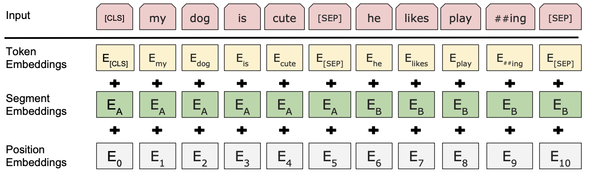
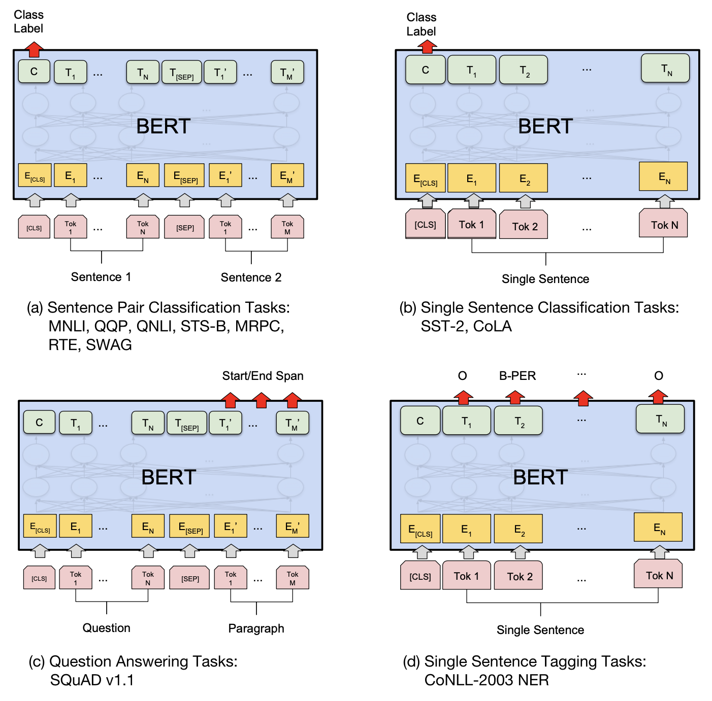

# BERT: Bidirectional Encoder Representations from Transformers.

Ссылка на [статью](https://arxiv.org/pdf/1810.04805.pdf)

Статья на [habr](https://habr.com/ru/companies/otus/articles/702838/)

**Вопросы**:
- Основные сведения
- Подробности модели
- Как проявляется двунаправленность?
- Как обучали?
- Как дообучать?
- Masked LM
- Next sentence prediction (NSP)

## Основные сведения

BERT: Bidirectional Encoder Representations from Transformers. Однако, в отличие от трансформера в Attention is all you need, здесь присутствует только энкодер. В оригинальной статье предложены 2 модели - $\text{BERT}_{base}$ и $\text{BERT}_{large}$. 

| Model name | Number of layers (L)| Hidden size (H)| Number of heads (A) | Total Parameters |
|-----------------------|------|------|----|------|
| $\text{BERT}_{base}$  | 12   | 768  | 12 | 110M |
| $\text{BERT}_{large}$ | 24   | 1024 | 16 | 340M |

Обучали на двух датасетах - Wikipedia (2.5B слов) + BookCorpus (800M слов) на две задачи:

- **Masked LM**. Предсказание замаскированного токена в предложении. Именно отсюда и идет двунаправленность BERT.
- **Next sentence prediction (NSP)**. Предсказание следующего предложения - "Правда ли, что следующее предложение действительно следующее?".

## Masked LM

15% выбранных токенов маскируется специальным образом:
- с вероятностью $p=0.8$ заменяем токен на специальный токен [MASK]
- с вероятностью $p=0.1$ заменяем на случайное слово
- с вероятностью $p=0.1$ оставляем неизменным

Сам процесс обучения описан следующим предложением: "In this case, the final hidden vectors corresponding to the mask tokens are fed into an output softmax over the vocabulary, as in a standard LM." То есть выходные вектора от масок проходят через softmax и предсказывают токен по словарю.

## Next sentence prediction (NSP)

Предсказание следующего предложения. Грубо говоря можно данную задачу свести к следующему вопросу - "Может ли следующее предложение стоять за текущим?". Выборка строится из предложений действительно следующих друг за другом и случайно взятыми.

Соотношение таких предложений одинаково (количество положительных классов равно количеству отрицательных)

## Input embeddings

Перед тем как подать на вход модели вектор, он кодируется специальным образом. Причем эмбеддинги (кроме position embeddings) являются обучаемыми.

## Fine-tuning

Можно обучать BERT на много задач, комбинируя подходы, на которые он обучался изначально.